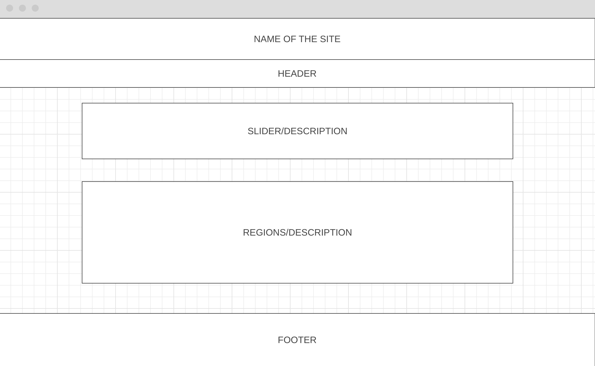

# C2: User Interface – Interface com o utilizador

## Interface

Neste projeto, utilizamos o Wireframe como uma ferramenta para proporcionar uma explicação mais clara e acessível aos utilizadores sobre como utilizar o site. Isso nos permite comunicar efetivamente a estrutura e o layout do site, oferecendo uma maneira compreensível para que os utilizadores entendam a totalidade do funcionamento do site.

#

## Wireframe

A imagem abaixo é o Wireframe inicialmente que tinhamos para o site. Tem o nome do site, header, o slider e uma pequena descrição, as regiões e uma pequena descrição para cada e por final o footer.

#

< Previous | | [Next >](c3.md)
:--- | :---: | ---: 

